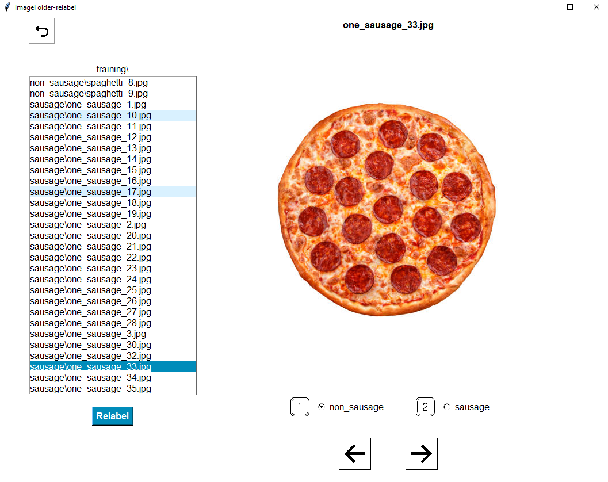

# ImageFolder-relabel

An open source GUI to enable quick and simple relabelling for Pytorch's `ImageFolder` dataset framework (or any other
ML `ImageFolder` framework for that matter). 



## Pytorch ImageFolder

Several machine learning frameworks exist that use a dataset's directory structure to understand which pieces of data 
belong to which class. When training a CV model this way, images are read from a folder where the folder 
name corresponds to the class it belongs to. Libraries such as 
[ML.NET](https://learn.microsoft.com/en-us/dotnet/api/microsoft.ml.data.imageloadingtransformer.imagefolder?view=ml-dotnet), 
[Tensorflow](https://www.tensorflow.org/datasets/api_docs/python/tfds/folder_dataset/ImageFolder) and 
[Pytorch] (https://pytorch.org/vision/main/generated/torchvision.datasets.ImageFolder.html) 
all have `ImageFolder` classes for this purpose. For example's sake, we'll use Pytorch. 

Pytorch's [datasets.ImageFolder](https://pytorch.org/vision/main/generated/torchvision.datasets.ImageFolder.html) class 
provides a convenient dataloader for image datasets. 
By providing a root directory, `ImageFolder` infers the image labels based on the subdirectory structure. 

For example, say we're building a [sausage-detector](https://github.com/JordanJWSmith/sausage-classifier). 
We use the following directory structure...

```
- input/
    - training/
        - sausage/
            - sausage_1.png
            - sausage_2.png
            - etc
        - non_sausage/
            - pizza_1.png
            - pasta_1.png
            - etc
    - validation/
        - sausage/
            - sausage_3.png
            - sausage_4.png
        - non_sausage/
            - pizza_2.png
            - pasta_2.png
            
```

By passing the `training` and `validation` directories to `ImageFolder`, the images are loaded and
the corresponding labels are inferred from their subdirectories.

```
train_dataset = datasets.ImageFolder(root='input/training_data', transform=train_transform)
valid_dataset = datasets.ImageFolder(root='input/validation_data',transform=valid_transform)
```

`ImageFolder-relabel` is a lightweight GUI allowing users to quickly browse through these images, 
assign new labels to any outliers and bulk refactor to relabel the images. 

## Setup
Add the top level of your image directory to `config.json`. Using the above example, this would be:
```
{
    "input_dir": "input/"
}
```

If this directory can't be found, a prompt will ask you whether you'd like to auto-generate sample data. 
A webscraped dataset will be built using the above directory structure, allowing for a quick demo of the software. 

Edit `image_queries.json` to amend the webscraping queries. 

## Use

Clone the repo and install the requirements using `pip install -r requirements.txt`.

Run `python main.py`. 

Choose which image directory you'd like to edit, then inspect the images. 
1. Cycle through images using your arrow keys or by clicking the 'next' button, or scroll through image names and click on the 
desired entry
2. Reassign image labels by pressing the corresponding number key or by clicking the desired radio button. 
3. Click `Relabel` to relabel the images


## Next Steps
- Explore adding lightweight KNN to identify outliers and prioritise relabelling